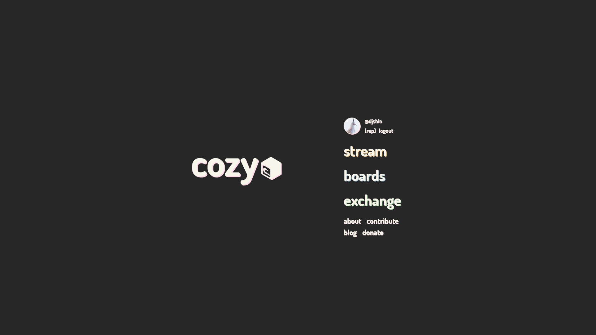

# cozy.nyc

## A site for NEETs...



[](https://travis-ci.org/cozy-nyc/cozy-nyc) [](https://david-dm.org/cozy-nyc/cozy.nyc) [](https://david-dm.org/cozy-nyc/cozy.nyc?type=dev)

--------------------------------------------------------------------------------

This is only the frontend for [cozy.nyc](https://cozy.nyc) the backend can be found here [cozy-api](https://github.com/cozy-nyc/cozy-api)

## Installation

```bash
yarn install
```

## Running Dev Server

```bash
yarn dev
```

The first time it may take a little while to generate the first `webpack-assets.json` and complain with a few dozen `[webpack-isomorphic-tools] (waiting for the first Webpack build to finish)` printouts, but be patient. Give it 30 seconds.


## Building and Running Production Server

```bash
yarn build
yarn start
```


### Unit Tests

The project uses [Jest](https://facebook.github.io/jest/) to run your unit tests.

To run the tests in the project, just simply run `npm test` if you have `Chrome` installed, it will be automatically launched as a test service for you.

## Join Our Discord

**Discord** - <https://discord.gg/3WSA2SG>

Special Thanks to [@bertho-zero](https://github.com/bertho-zero) for providing <https://github.com/bertho-zero/react-redux-universal-hot-example>
